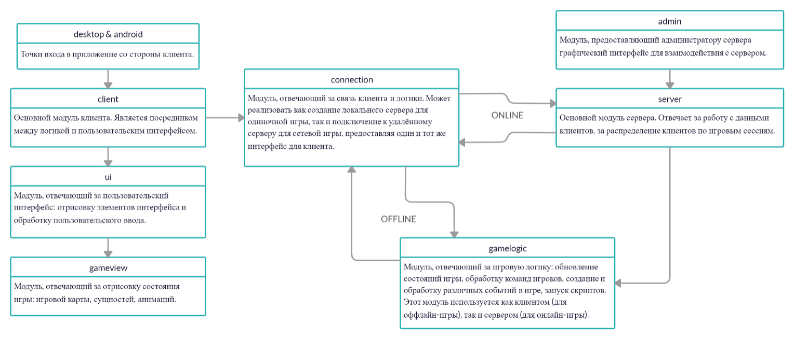

# Shattered World Game (WIP)

Экшн-РПГ, о которой я давно мечтал и на которой учусь кодить :)

Тут можно будет грабить корованы, здесь ты убиваешь зомби или ты сам есть зомби!
    
## Скачать без смс и регистрации

Если кому-то интересно посмотреть, что уже готово на данный момент (пока что ничего), *[можно скачать jar-файл с последней готовой версией и запустить его с помощью Java]( https://github.com/ardenit/Shattered-World/raw/master/Shattered-World.jar)*.

# Уголок интервьюера :)

## Используемые технологии

Активно используются:
 - Kotlin
 - JUnit, Mockito
 - Gradle, Git, Travis CI, Codecov
 - GSON
 - Lua (+ LuaJ)
 - LibGDX
 
Активно изучаются и будут использоваться:
 - Kotlin Coroutines
 - Netty (+ RxNetty)

## Кратко об архитектуре

