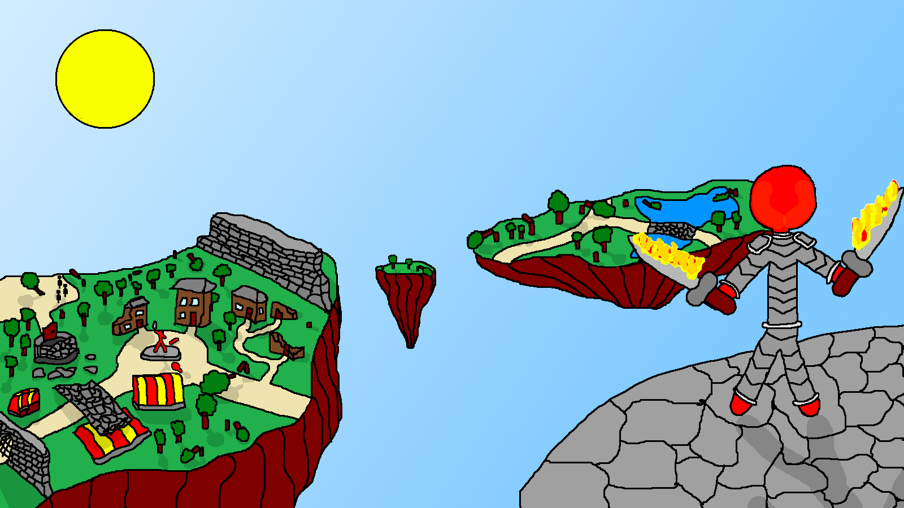

# Shattered World Game (WIP)

## Мануал по установке

*Вообще можно не клонировать весь репозиторий, а [скачать только jar-ник и запустить его](
        https://github.com/Mirage-A/Shattered-World/raw/master/SW%20-%20Game.jar
      ). Но если хочется собирать исходники, то вот гуид :)*

Команды для установки на убунту:

 + Устанавливаем Java 8
    
    `sudo add-apt-repository ppa:webupd8team/java`
    
    `sudo apt install oracle-java8-set-default`
    
 + Клонируем репозиторий

    `git clone https://github.com/Mirage-A/Shattered-World.git`
    
    `cd Shattered-World`
    
 + Переключаемся на ветку без android-а (а то еще придется Android SDK устанавливать) и собираем модуль desktop с помощью Gradle:

    `git checkout light`
        
    `chmod +x ./gradlew`
        
    `./gradlew wrapper :desktop:run`

Shattered World is an RPG that i develop in my free time

There is A LOT of work to be done to make my dreams come true, but one can always try what is done at the moment (currently nothing) by downloading game [here](https://mirage-a.github.io) and launching downloaded .jar file with Java

And yes, i draw everyfin in Paint ;)

One day i'll complete it :) (if i wont be expelled earlier)
